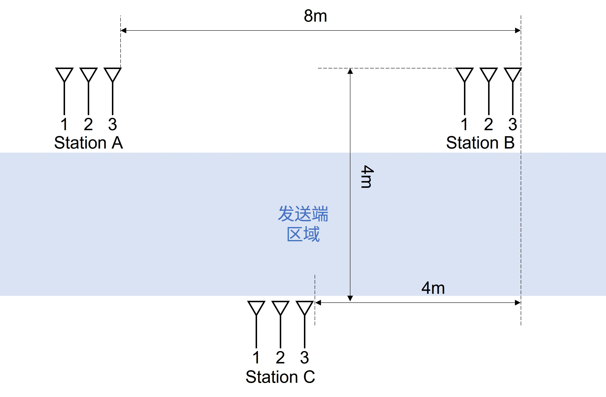
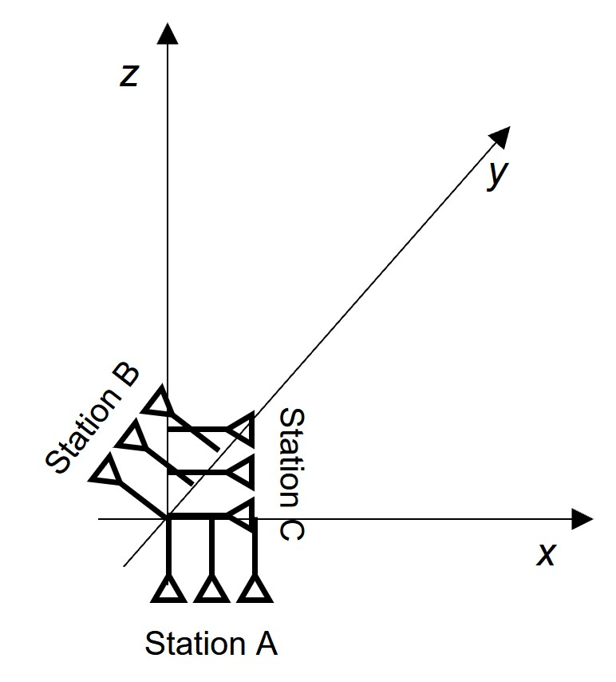
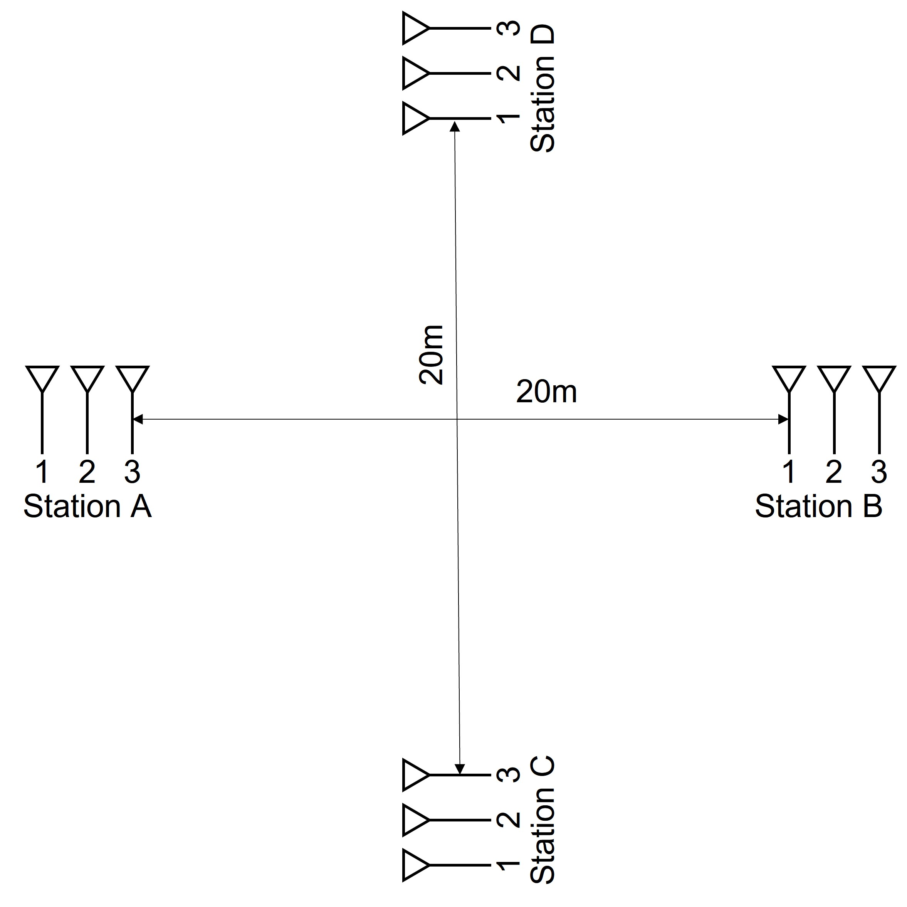

# SpotFi无人机实验方案

基本参数

- 5540MHz, 20HT, $\lambda=5.4114\times 10^{-2}m$
- BW=20MHz, Subcarriers=64（实际可用57）, $\Delta f=312500Hz$
- 天线间距 $d=0.03m$
- 保证天线垂直于地面

baseline: $0.40m$（SpotFi论文）

## A. 一发一收（地面）

> 仅验证AoA
>
> 离线处理数据

发送端：

- $0.5s$间隔，不间断发包，参数见上

接收端：分别在以下方向/距离

- AoA选择： $0, \pm\frac{\pi}{6}, \pm\frac{\pi}{3}, \pm\frac{\pi}{2}$
- Dis距离： $1m, 3m, 5m, 8m, 10m$

实验中，在每个AoA-Dis组合**静置测量大约50个包**

| 标准AoA  | 距离/m   | 测量结果AoA |
| -------- | -------- | ----------- |
| 0        | 1        |             |
| 0        | 3        |             |
| 0        | 5        |             |
| 0        | 8        |             |
| 0        | 10       |             |
| $\cdots$ | $\cdots$ | $\cdots$    |

### \*A.2一发一收（地面，动）

> 如果上面效果比较好的话

对于每个AoA，让发送端分别切向和径向运动

- 径向： $1m \rightarrow 10m$
- 切向： $-\frac{\pi}{6} \rightarrow \frac{\pi}{6}$, $-\frac{\pi}{3} \rightarrow \frac{\pi}{3}$, $-\frac{\pi}{2} \rightarrow \frac{\pi}{2}$

操作要点：

- 尽量保证匀速运动
- 前10个包一般要舍弃，从包11th开始移动

## B.一发三收（地面）

> 仅测量AoA
>
> 三角定位

| Ground Truth/(m,m) | AB联立   | BC联立   | AC联立   |
| ------------------ | -------- | -------- | -------- |
| (4,2)              |          |          |          |
| (2,4)              |          |          |          |
| (6,4)              |          |          |          |
| $\cdots$           | $\cdots$ | $\cdots$ | $\cdots$ |

## C.一发一收（无人机）

> 验证单个角AoA，这个AoA应该是与法平面的夹角
>
> 实验细节可以参考A部分

- 天线仍然与地面垂直

发送端：

- $0.5s$间隔，不间断发包，参数见上

接收端：分别在以下方向/距离

- AoA选择： $0, \pm\frac{\pi}{6}, \pm\frac{\pi}{3}, \pm\frac{\pi}{2}$
- Dis距离： $1m, 3m, 5m, 8m, 10m$

实验中，在每个AoA-Dis组合**<i>静置</i>测量大约50个包**

## D.一发三收（地面，无人机）

> 三个接收端放在同一个地方，但是两两正交
>
> 目标是求解出空间方向（不含距离）

设A,B,C三个station测量到的AoA分别为$\alpha,\beta,\gamma$，目标的位矢为$\vec r$，那么有如下关系

- $x=\Vert\vec r\Vert\sin{\alpha}$
- $y=\Vert\vec r\Vert\sin{\beta}$
- $z=\Vert\vec r\Vert\sin{\gamma}$

并且三个角度满足$\sin^2{\alpha}+\sin^2{\beta}+\sin^2{\gamma}=1$

可以由两两之间验证第三个夹角

实验细节可以参考B部分

## E.一发四收

> 类似B的思想，两对接收端，正交部署
>
> 最后求解肯定是超定的，用最小二乘拟合
>
> // TODO

